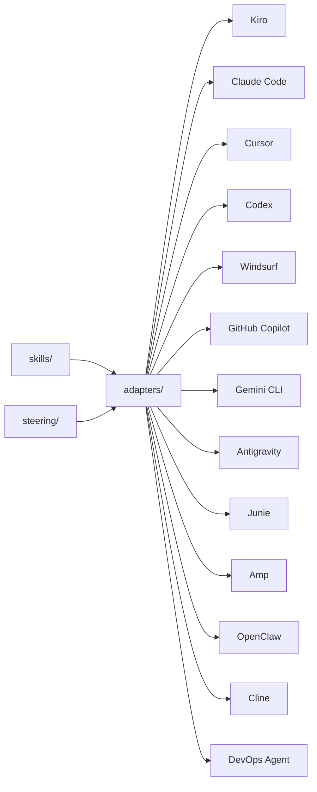
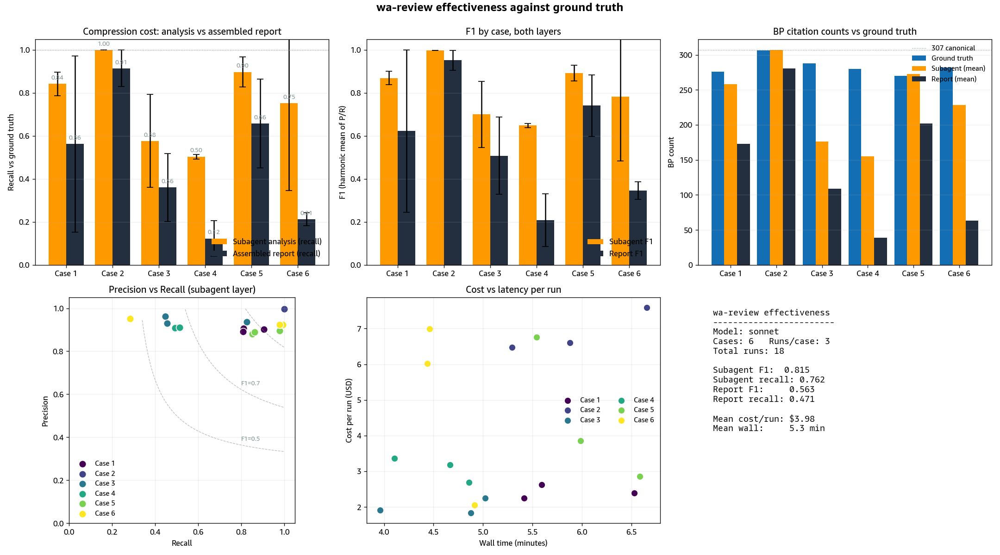

# 🏗️ Well-Architected Skills & Steering for AI Coding Agents

Reusable skills and steering that teach AI coding agents how to apply the [AWS Well-Architected Framework](https://docs.aws.amazon.com/wellarchitected/latest/framework/welcome.html). One set of playbooks, **14 supported tools**.

<div align="center">

**Kiro** · **Kiro CLI** · **Claude Code** · **Cursor** · **Codex** · **Windsurf** · **GitHub Copilot** · **Gemini CLI** · **Antigravity** · **Junie** · **Amp** · **OpenClaw** · **Cline** · **Cortex Code** · **AWS DevOps Agent**

</div>

> [!IMPORTANT]
> This sample is provided for educational and demonstrative purposes. It is not intended for production use without additional review and testing appropriate to your environment. Reference content is current as of the download date — keeping it up to date is the responsibility of the user.

---

## 🎯 Why this exists

Developers don't stop to consult documentation — they ask their AI assistant. If the assistant doesn't know the Well-Architected Framework, the guidance never reaches the code.

This project embeds WA best practices **where development actually happens**: in the IDE, at the moment code is being written. Instead of treating architecture reviews as a separate gate, teams get continuous, contextual guidance that:

- ✅ Reduces rework by catching misalignments early
- ✅ Works across 14 AI coding tools with a single source of truth
- ✅ Requires no AWS credentials, no API calls — everything runs locally
- ✅ Follows the open [Agent Skills specification](https://agentskills.io/)

---

## 📦 What's inside

```text
steering/                           Always-on context (Kiro)
  well-architected.md                 Pillars, design principles, review process
  wa-review.md                        Deep multi-step WA review (evidence-based, constrained)

skills/                             Step-by-step playbooks (tool-agnostic)
  wa-review/                          Full or pillar-scoped review (all 6 pillars + 27 lenses)
    references/manifest.md              Canonical catalog of all 307 BP IDs (loaded first)
    references/pillars/                 6 pillar-merged files (one per pillar; subagent references)
    references/lenses/                  Lens-specific references (27 lenses)
    references/pillar-playbooks/        Per-pillar deep-dive discovery procedures
  wa-builder/                         Learn WA + produce artifacts (diagrams, trees, roadmaps, ADRs)
  wa-guardrails/                      Preventive controls (Config rules, SCPs, CI checks)
  wafr-facilitator/                   Conversational WAFR facilitation with customers
  migration-readiness/                7 Rs assessment with migration plan

scripts/                            Maintenance tooling
  crawl-wa-framework.py               Crawl AWS docs to regenerate reference files

adapters/                           Tool-specific configuration
  claude-code/                        CLAUDE.md + slash commands
  cursor/                             .cursor/rules/*.md
  codex/                              AGENTS.md
  windsurf/                           .windsurfrules
  github-copilot/                     .github/copilot-instructions.md
  cline/                              .clinerules
  gemini-cli/                         GEMINI.md
  antigravity/                        .agents/rules/*.md
  junie/                              .junie/guidelines + .junie/skills
  amp/                                .agents/skills/*.md
  openclaw/                           AGENTS.md + .agents/skills/*.md
  cortex-code/                        AGENTS.md + skills/*.md (Snowflake)
  devops-agent/                       Packaging for AWS DevOps Agent

powers/                             Kiro Powers
  wa-review/                          Full WA review with auto-activation and progressive references

evals/                              Automated evaluation runner (Bedrock)
  run.py                              CLI entry point
  grade.py                            LLM-as-judge grader
  report.py                           Scoring and terminal output
  config.yaml                         Bedrock region and model config
  benchmark.py                        Multi-model comparison runner
  benchmark_report.py                 Generate markdown tables from benchmark results
  benchmark_config.yaml               Models, prompt, and grading criteria
  pyproject.toml                      Dependencies (use uv sync)

install.sh                          One-command setup (macOS/Linux)
install.ps1                         One-command setup (Windows PowerShell)
```

---

## 🚀 Quick start

### One-liner (no clone needed)

#### Via [skills.sh](https://skills.sh)

```bash
npx skills add aws-samples/sample-well-architected-skills-and-steering
```

Auto-detects your AI agent and installs skills directly. Use `--list` to preview available skills, or `--skill <name>` to install a specific one:

```bash
# List available skills
npx skills add aws-samples/sample-well-architected-skills-and-steering --list

# Install a specific skill
npx skills add aws-samples/sample-well-architected-skills-and-steering --skill wa-review

# Install globally (user-level, applies to all projects)
npx skills add aws-samples/sample-well-architected-skills-and-steering -g
```

#### Via bootstrap script

**macOS / Linux:**

```bash
curl -sL https://raw.githubusercontent.com/aws-samples/sample-well-architected-skills-and-steering/main/bootstrap.sh | bash
```

**Windows (PowerShell):**

```powershell
& ([scriptblock]::Create((irm https://raw.githubusercontent.com/aws-samples/sample-well-architected-skills-and-steering/main/bootstrap.ps1)))
```

Auto-detects your AI tools (`.cursor/`, `.claude/`, `.kiro/`, `.junie/`, `.openclaw/`, etc.), installs for all of them, and cleans up.

To install for a specific tool instead:

```bash
# macOS / Linux
curl -sL .../bootstrap.sh | bash -s -- --tool kiro

# Windows (PowerShell)
& ([scriptblock]::Create((irm .../bootstrap.ps1))) -Tool kiro
```

### Install script (from local clone)

**macOS / Linux:**

```bash
# Auto-detect tools in your project
./install.sh ~/my-project --tool auto

# Install for a specific tool
./install.sh ~/my-project --tool claude-code

# Install for multiple tools at once
./install.sh ~/my-project --tool kiro --tool claude-code --tool cursor

# Install for all supported tools
./install.sh ~/my-project --tool all

# Use symlinks for automatic updates
./install.sh ~/my-project --tool claude-code --symlink

# Install globally (applies to all projects)
./install.sh --global --tool claude-code
```

**Windows (PowerShell):**

```powershell
# Auto-detect tools in your project
.\install.ps1 -TargetDir C:\Projects\my-app -Tool auto

# Install for a specific tool
.\install.ps1 -TargetDir C:\Projects\my-app -Tool claude-code

# Install for multiple tools at once
.\install.ps1 -Tool kiro, claude-code, cursor

# Install for all supported tools
.\install.ps1 -Tool all -Force

# Install globally (applies to all projects)
.\install.ps1 -Global -Tool claude-code
```

> [!TIP]
> Use `--symlink` (bash) or `-Symlink` (PowerShell) to create symbolic links instead of copies. When this repo updates, your project gets the changes automatically without reinstalling. On Windows, symlinks require elevated permissions.

> [!NOTE]
> **Global installs** place files in your home directory (`~/CLAUDE.md`, `~/.kiro/`, `~/.cursor/`, etc.) and apply to all projects without their own config. Use project-level installation (the default) if you only want WA guidance for specific projects.
>
> **Existing files** — the installer prompts before overwriting. Use `--force` to skip confirmation.

---

### Manual installation

<details>
<summary><strong>🔹 Kiro</strong></summary>

macOS / Linux:

```bash
mkdir -p .kiro/steering .kiro/skills
cp path/to/this-repo/steering/well-architected.md .kiro/steering/
cp -r path/to/this-repo/skills/* .kiro/skills/
```

Windows (PowerShell):

```powershell
New-Item -ItemType Directory -Force -Path .kiro\steering, .kiro\skills
Copy-Item path\to\this-repo\steering\well-architected.md .kiro\steering\
Copy-Item -Recurse path\to\this-repo\skills\* .kiro\skills\
```

</details>

<details>
<summary><strong>🔹 Kiro Power (recommended for Kiro users)</strong></summary>

The Kiro Power bundles the wa-review skill + steering + all reference material into a single installable unit with keyword-based auto-activation.

**Install from local clone:**

```bash
git clone https://github.com/aws-samples/sample-well-architected-skills-and-steering.git
```

Then in Kiro: Powers panel → **Add Custom Power** → **Import power from a folder** → select `powers/wa-review/`

**What you get:**

- Auto-activates when you mention "well-architected", "architecture review", "security review", "reliability", etc.
- Loads only relevant steering based on your current task
- Parallel per-pillar reference loading (6 pillar files + 27 lens packs, one file per Task subagent) — managed automatically

> [!NOTE]
> Kiro's "Import from GitHub" expects `POWER.md` at the repository root. Since this repo contains multiple skills and adapters, the Power lives under `powers/wa-review/` and must be imported from a local folder. If you want GitHub-based import, you can fork just the `powers/wa-review/` directory into its own repo.

</details>

<details>
<summary><strong>🔹 Claude Code</strong></summary>

macOS / Linux:

```bash
cp path/to/this-repo/adapters/claude-code/CLAUDE.md ./CLAUDE.md
cp -r path/to/this-repo/adapters/claude-code/commands .claude/commands
```

Windows (PowerShell):

```powershell
Copy-Item path\to\this-repo\adapters\claude-code\CLAUDE.md .\CLAUDE.md
Copy-Item -Recurse path\to\this-repo\adapters\claude-code\commands .claude\commands
```

</details>

<details>
<summary><strong>🔹 Cursor</strong></summary>

macOS / Linux:

```bash
cp -r path/to/this-repo/adapters/cursor/rules .cursor/rules
```

Windows (PowerShell):

```powershell
Copy-Item -Recurse path\to\this-repo\adapters\cursor\rules .cursor\rules
```

</details>

<details>
<summary><strong>🔹 Codex (OpenAI)</strong></summary>

macOS / Linux:

```bash
cp path/to/this-repo/adapters/codex/AGENTS.md ./AGENTS.md
cp -r path/to/this-repo/skills ./skills
```

Windows (PowerShell):

```powershell
Copy-Item path\to\this-repo\adapters\codex\AGENTS.md .\AGENTS.md
Copy-Item -Recurse path\to\this-repo\skills .\skills
```

</details>

<details>
<summary><strong>🔹 Windsurf</strong></summary>

macOS / Linux:

```bash
cp path/to/this-repo/adapters/windsurf/.windsurfrules ./.windsurfrules
```

Windows (PowerShell):

```powershell
Copy-Item path\to\this-repo\adapters\windsurf\.windsurfrules .\.windsurfrules
```

</details>

<details>
<summary><strong>🔹 GitHub Copilot</strong></summary>

macOS / Linux:

```bash
mkdir -p .github
cp path/to/this-repo/adapters/github-copilot/.github/copilot-instructions.md .github/
```

Windows (PowerShell):

```powershell
New-Item -ItemType Directory -Force -Path .github
Copy-Item path\to\this-repo\adapters\github-copilot\.github\copilot-instructions.md .github\
```

</details>

<details>
<summary><strong>🔹 Gemini CLI</strong></summary>

macOS / Linux:

```bash
cp path/to/this-repo/adapters/gemini-cli/GEMINI.md ./GEMINI.md
cp -r path/to/this-repo/skills ./skills
```

Windows (PowerShell):

```powershell
Copy-Item path\to\this-repo\adapters\gemini-cli\GEMINI.md .\GEMINI.md
Copy-Item -Recurse path\to\this-repo\skills .\skills
```

</details>

<details>
<summary><strong>🔹 Antigravity</strong></summary>

macOS / Linux:

```bash
mkdir -p .agents/rules .agents/skills
cp -r path/to/this-repo/adapters/antigravity/rules/* .agents/rules/
for skill_dir in path/to/this-repo/skills/*/; do
  skill_name=$(basename "$skill_dir")
  mkdir -p ".agents/skills/$skill_name"
  cp "$skill_dir/SKILL.md" ".agents/skills/$skill_name/SKILL.md"
done
```

Windows (PowerShell):

```powershell
New-Item -ItemType Directory -Force -Path .agents\rules, .agents\skills
Copy-Item -Recurse path\to\this-repo\adapters\antigravity\rules\* .agents\rules\
Get-ChildItem path\to\this-repo\skills -Directory | ForEach-Object {
    New-Item -ItemType Directory -Force -Path ".agents\skills\$($_.Name)"
    Copy-Item "$($_.FullName)\SKILL.md" ".agents\skills\$($_.Name)\SKILL.md"
}
```

</details>

<details>
<summary><strong>🔹 Junie (JetBrains)</strong></summary>

macOS / Linux:

```bash
mkdir -p .junie/guidelines .junie/skills
cp path/to/this-repo/adapters/junie/guidelines.md .junie/guidelines/well-architected.md
cp -r path/to/this-repo/skills/* .junie/skills/
```

Windows (PowerShell):

```powershell
New-Item -ItemType Directory -Force -Path .junie\guidelines, .junie\skills
Copy-Item path\to\this-repo\adapters\junie\guidelines.md .junie\guidelines\well-architected.md
Copy-Item -Recurse path\to\this-repo\skills\* .junie\skills\
```

</details>

<details>
<summary><strong>🔹 Amp</strong></summary>

macOS / Linux:

```bash
cp path/to/this-repo/adapters/amp/AGENTS.md ./AGENTS.md
mkdir -p .agents/skills
cp -r path/to/this-repo/skills/* .agents/skills/
```

Windows (PowerShell):

```powershell
Copy-Item path\to\this-repo\adapters\amp\AGENTS.md .\AGENTS.md
New-Item -ItemType Directory -Force -Path .agents\skills
Copy-Item -Recurse path\to\this-repo\skills\* .agents\skills\
```

</details>

<details>
<summary><strong>🔹 OpenClaw</strong></summary>

macOS / Linux:

```bash
cp path/to/this-repo/adapters/openclaw/AGENTS.md ./AGENTS.md
mkdir -p .agents/skills
cp -r path/to/this-repo/skills/* .agents/skills/
```

Windows (PowerShell):

```powershell
Copy-Item path\to\this-repo\adapters\openclaw\AGENTS.md .\AGENTS.md
New-Item -ItemType Directory -Force -Path .agents\skills
Copy-Item -Recurse path\to\this-repo\skills\* .agents\skills\
```

</details>

<details>
<summary><strong>🔹 Cline</strong></summary>

macOS / Linux:

```bash
cp path/to/this-repo/adapters/cline/.clinerules ./.clinerules
```

Windows (PowerShell):

```powershell
Copy-Item path\to\this-repo\adapters\cline\.clinerules .\.clinerules
```

</details>

<details>
<summary><strong>🔹 AWS DevOps Agent</strong></summary>

macOS / Linux:

```bash
# Package all skills as zip files for upload to your Agent Space
./install.sh ~/output-dir --tool devops-agent
# Then upload each .zip from ~/output-dir/devops-agent-skills/ via the Operator Web App
```

Windows (PowerShell):

```powershell
# Package all skills as zip files for upload to your Agent Space
.\install.ps1 -TargetDir C:\output-dir -Tool devops-agent
# Then upload each .zip from C:\output-dir\devops-agent-skills\ via the Operator Web App
```

</details>

---

## ⚙️ How it works



| Component | What it does |
| --------- | ------------ |
| **Skills** (`skills/*/SKILL.md`) | Self-contained, tool-agnostic playbooks. Any AI agent can follow them step-by-step. They don't depend on steering or on each other. |
| **Steering** (`steering/*.md`) | Always-on context loaded into every Kiro conversation. Other tools use equivalent mechanisms via adapters. |
| **Powers** (`powers/*/`) | Bundled, installable units for Kiro. Package steering + MCP tools + hooks into a single activatable power. |
| **Adapters** (`adapters/`) | Translate steering into each tool's native config format and wire up skills as commands or rules. |
| **Assets** (`assets/`) | Shared reference material (metrics, patterns, best practices) bundled with skills for tools that support it. |

### Tool compatibility matrix

| Tool | Steering mechanism | Skills mechanism |
| ---- | ------------------ | ---------------- |
| Kiro | `.kiro/steering/*.md` | `.kiro/skills/*/SKILL.md` |
| Claude Code | `CLAUDE.md` | `.claude/commands/*.md` (slash commands) |
| Cursor | `.cursor/rules/*.md` | Rules with conditional activation |
| Codex | `AGENTS.md` | References `skills/` directory |
| Windsurf | `.windsurfrules` | References `skills/` directory |
| GitHub Copilot | `.github/copilot-instructions.md` | Inline (no separate skill mechanism) |
| Cline | `.clinerules` | References `skills/` directory |
| Gemini CLI | `GEMINI.md` | References `skills/` directory |
| Antigravity | `.agents/rules/*.md` | `.agents/skills/*/SKILL.md` |
| Junie | `.junie/guidelines/*.md` | `.junie/skills/*/SKILL.md` |
| Amp | `AGENTS.md` | `.agents/skills/*/SKILL.md` |
| OpenClaw | `AGENTS.md` | `.agents/skills/*/SKILL.md` |
| AWS DevOps Agent | N/A (skills are self-contained) | `SKILL.md` zip upload to Agent Space |

---

## 📋 Skills overview

| Skill | Pillar(s) | Use when you need to... |
| ----- | --------- | ----------------------- |
| `wa-review` | All 6 | Full or pillar-scoped WA assessment with BP-level citations |
| `wa-builder` | All 6 | Learn WA + produce artifacts (diagrams, decision trees, roadmaps, ADRs) |
| `wa-guardrails` | All 6 | Generate preventive controls (Config rules, SCPs, CI checks, alarms) |
| `wafr-facilitator` | All 6 | Prepare conversational WAFR facilitation with customers |
| `migration-readiness` | All 6 | Assess readiness to migrate a workload to AWS |

**Pillar aliases** (route to `wa-review` with pillar scope):

| Command | Scope |
|---------|-------|
| `security-assessment` | Security pillar deep-dive |
| `reliability-improvement-plan` | Reliability pillar deep-dive |
| `cost-optimization-review` | Cost Optimization pillar deep-dive |
| `performance-efficiency` | Performance Efficiency pillar deep-dive |
| `sustainability-optimization` | Sustainability pillar deep-dive |
| `operational-excellence` | Operational Excellence pillar deep-dive |
| `architecture-decision-record` | wa-builder ADR mode |

---

## 📊 Reference data and token consumption

The `wa-review` skill includes **307 best practices** across **57 framework questions** plus **27 lens extensions** — sourced directly from the [AWS Well-Architected public documentation](https://docs.aws.amazon.com/wellarchitected/latest/framework/welcome.html). This reference data lives in `skills/wa-review/references/` and is loaded one pillar file at a time (via parallel `Task` subagents in v4.2+), not all at once.

### Reference data summary

| Content | Files | Size | Loaded when |
|---------|-------|------|-------------|
| Framework pillars (merged) | 6 | 2.2 MB | Full review — one pillar file per parallel `Task` subagent (v4.2+) |
| Serverless Lens | 6 | 120 KB | Workload uses Lambda/API Gateway/Step Functions |
| Generative AI Lens | 29 | 368 KB | LLM, RAG, or fine-tuning workloads |
| Agentic AI Lens | 41 | 1.2 MB | AI agent workloads |
| Responsible AI Lens | 28 | 780 KB | AI governance and fairness requirements |
| Hybrid Networking Lens | 30 | 480 KB | Direct Connect, VPN, Transit Gateway |
| Migration Lens | 6 | 76 KB | Migration planning |
| DevOps Guidance Lens | 196 | 820 KB | CI/CD, automated governance, dev lifecycle, observability |
| Machine Learning Lens | 35 | 852 KB | ML lifecycle (MLOPS), training/deployment, data engineering, responsible ML |
| Data Analytics Lens | 6 | 180 KB | Data pipelines, governance, catalogs, lineage, analytics perf & cost |
| Games Industry Lens | 32 | 316 KB | Game backends, real-time multiplayer, player data, live ops |
| SaaS Lens | 6 | 112 KB | Multi-tenancy, tenant isolation, onboarding, metering, tiering |
| Financial Services Lens | 79 | 432 KB | FSI compliance, data residency, resilience, auditability |
| Life Sciences Lens | 56 | 468 KB | GxP, validated systems, clinical/research data, compliance |
| End User Computing Lens | 69 | 372 KB | Virtual desktops/apps, streaming, identity, endpoint delivery |
| Supply Chain Lens | 51 | 244 KB | Supply chain data, integration, traceability, resilience |
| Video Streaming & Advertising Lens | 43 | 296 KB | Video pipelines, streaming delivery, ad tech, monetization |
| Telco Lens | 34 | 272 KB | Telecom workloads, 5G/edge, OSS/BSS, carrier-grade reliability |
| SAP Lens | 6 | 380 KB | SAP on AWS, S/4HANA, HANA databases, SAP landscape resilience |
| Modern Industrial Data Technology Lens | 34 | 300 KB | Industrial data platforms, OT/IT convergence, manufacturing analytics |
| Microsoft Workloads Lens | 23 | 368 KB | Windows Server, SQL Server, Active Directory, .NET on AWS |
| Connected Mobility Lens | 6 | 284 KB | Connected vehicles, telematics, fleet data, automotive platforms |
| Healthcare Industry Lens | 6 | 92 KB | HIPAA, clinical data, interoperability, patient privacy |
| Container Build Lens | 6 | 76 KB | Container image builds, supply chain security, registries, CI/CD |
| High Performance Computing Lens | 23 | 104 KB | HPC clusters, parallel workloads, scheduling, low-latency networking |
| Streaming Media Lens | 6 | 96 KB | Media streaming, live/VOD delivery, encoding, content workflows |
| IoT Lens | 59 | 369 KB | IoT devices, telemetry, edge computing, fleet provisioning, OTA updates |
| Government Lens | 6 | 46 KB | Public sector, privacy-by-design, compliance, real-time security |

### Token strategies

A **full review** loads all 6 pillar files (~500K–600K input tokens of reference material). Most single-context models have limits below that, which is why v4.2+ dispatches **one Task subagent per pillar** — each subagent loads only its own pillar file (~150–580 KB), so no single context holds the whole corpus. Alternative modes for smaller footprints:

| Strategy | How | Best for |
|----------|-----|----------|
| **Quick review** | Ask for "quick review" — evaluates at question level using SKILL.md summaries only (no BP reference files loaded) | Fast feedback, budget-conscious |
| **Pillar-scoped** | Ask for specific pillars ("review security and reliability only") — loads only 2 pillar files | Targeted deep-dives |
| **Lens-only** | Ask for just a lens review ("evaluate against the serverless lens") — skips core pillars | Domain-specific checks |
| **Progressive** | Start quick, then drill into flagged pillars | Balanced depth vs cost |

> [!TIP]
> **Recommended workflow for cost-effective reviews:**
> 1. Start with a **quick review** to identify which pillars have gaps
> 2. Then do a **pillar-scoped full review** on only the weak areas
> 3. Apply a **lens** if the workload type warrants it
>
> This typically loads 1–2 pillar files (~100–300 KB) instead of all 6 (~2.2 MB) plus lenses.

> [!NOTE]
> **How the agent manages context:** In v4.2+, the skill dispatches **6 parallel `Task` subagents** (one per pillar) so each subagent's context holds only its own pillar file — the full 2.2 MB corpus is never in a single context. The manifest (~24 KB) is the only file the top-level agent loads upfront. See the `Coverage strategy` section in [wa-review/SKILL.md](skills/wa-review/SKILL.md) for full details.

### Estimated costs

Token estimates assume ~4 characters per token. Costs use [Claude Opus 4 pricing](https://docs.anthropic.com/en/docs/about-claude/models#model-comparison-table) ($15/M input, $75/M output) as a reference — actual costs vary by model, provider, and whether you use caching. Pricing checked June 2026; verify current rates at the link above.

| Review type | Reference tokens loaded | Est. input cost | Est. total cost |
|-------------|------------------------|-----------------|-----------------|
| **Quick review** (no reference files) | ~5K (SKILL.md only) | < $0.01 | ~$0.50–$1.00 |
| **Pillar-scoped** (1–2 pillar files) | ~50–150K | ~$0.75–$2.25 | ~$2–$5 |
| **Full review, subagent-mode** (6 pillars in parallel, one per subagent) | ~550K total | ~$8.25 | ~$10–$15 |
| **+ Serverless Lens** | +27K | +$0.40 | +$0.50–$1.00 |
| **+ Generative AI Lens** | +80K | +$1.20 | +$1.50–$3.00 |
| **+ Agentic AI Lens** | +294K | +$4.40 | +$5–$8 |

Total cost includes output tokens (the report itself, typically 8K–30K tokens depending on findings).

**Cost-saving tips:**
- Use the two-pass approach (default) — only loads files for questions with gaps
- Scope to specific pillars — e.g., "review security only" loads ~10 files instead of 57
- Use a smaller model for Pass 1 (quick scan) and a stronger model for Pass 2 (deep dive)
- Enable prompt caching if your provider supports it — the reference files are static and cache well

### Regenerating reference data

The reference files are committed to this repo as a snapshot of the AWS Well-Architected public docs at the time of the last crawl. **You are responsible for checking whether the data needs updating before use** — AWS updates the framework and lens pages over time, and stale references can produce outdated guidance. If in doubt, compare a few BP pages against the [live AWS docs](https://docs.aws.amazon.com/wellarchitected/latest/framework/welcome.html) or re-run the crawler. To refresh:

```bash
# Regenerate all 6 pillar-merged framework files
uv run scripts/crawl-wa-framework.py

# Regenerate a single pillar
uv run scripts/crawl-wa-framework.py --pillar security

# Add or refresh a lens
uv run scripts/crawl-wa-framework.py --lens https://docs.aws.amazon.com/wellarchitected/latest/serverless-applications-lens/welcome.html

# Lenses that use the dotted best-practice ID format (e.g. DevOps Guidance)
uv run scripts/crawl-wa-framework.py --lens https://docs.aws.amazon.com/wellarchitected/latest/devops-guidance/devops-guidance.html --lens-name devops-guidance
```

---

## ✅ Verifying it works

Ask your AI coding agent:

```text
What Well-Architected pillars should I consider for this architecture?
```

If configured correctly, it will reference all six pillars with specific guidance rather than giving a generic answer.

> [!TIP]
> **Claude Code users**: try `/wa-review` to invoke the full review skill as a slash command.
>
> **Kiro users**: the steering loads automatically — just start discussing architecture and the agent applies WA principles.

---

## 🧪 Evaluating skills

Each skill includes structured evaluations in `skills/*/evals/evals.json` following the [Agent Skills eval spec](https://agentskills.io/skill-creation/evaluating-skills). Evals let you measure whether the skills produce better outputs than a bare agent.

Each test case includes:

- A realistic user prompt
- Expected output description
- 5-7 concrete assertions (gradable as PASS/FAIL)

### Automated eval runner

The `evals/` directory contains an automated evaluation runner powered by **Amazon Bedrock**.

**Prerequisites:**

- Python 3.13+ and [uv](https://docs.astral.sh/uv/)
- AWS credentials configured with Bedrock access (`aws configure` or SSO)
- Bedrock model access enabled for the models in `evals/config.yaml` (Claude Opus 4.8 by default) in your region

**Setup:**

```bash
cd evals
uv sync
```

**Run evaluations:**

macOS / Linux / Windows (PowerShell):

```bash
# List available skills
uv run python run.py --list

# Evaluate a single skill
uv run python run.py --skill wa-review --verbose

# Evaluate all skills with parallel case execution
uv run python run.py --parallel --verbose

# Save results for historical tracking
uv run python run.py --parallel --save
```

> [!NOTE]
> On Windows, ensure your AWS credentials are configured via `aws configure` or environment variables (`AWS_ACCESS_KEY_ID`, `AWS_SECRET_ACCESS_KEY`, `AWS_SESSION_TOKEN`). If using AWS IAM Identity Center (SSO), run `aws sso login --profile your-profile` first.

**How it works:**

1. For each test case, generates two responses via Bedrock Converse API:
   - **Baseline** — prompt only, no skill context
   - **With skill** — prompt + SKILL.md injected as system context
2. An LLM-as-judge grades each assertion as PASS/FAIL against both outputs
3. Reports a score comparison showing the skill's impact

**Configuration** (`evals/config.yaml`):

```yaml
provider: bedrock
region: us-east-1
generation_model: us.anthropic.claude-opus-4-8
grading_model: us.anthropic.claude-opus-4-8
max_tokens: 16384
```

**Estimated cost per run:**

| Scope | Generation calls | Grading calls | Estimated cost |
| ----- | ---------------- | ------------- | -------------- |
| Single skill (3 cases) | 6 (Opus) | 6 (Opus) | ~$1.50 – $2.50 |
| All 11 skills (33 cases) | 66 (Opus) | 66 (Opus) | ~$15 – $25 |

Cost breakdown assumes ~1K input tokens and ~8K output tokens per generation call (16k max), and ~9K input / ~500 output per grading call. Actual cost depends on response length and Bedrock pricing in your region. Use `--parallel` for ~3x faster wall-clock time. You can use cheaper models (Sonnet, Haiku) by updating `config.yaml`.

> [!TIP]
> **Experiment with other models!** The eval runner works with any model available in Bedrock — try Amazon Nova, Meta Llama, Mistral, or others to see how different foundation models respond to skill guidance. Use the discovery utility to see what's available in your region:
>
> `uv run python list_models.py`
>
> Then update `generation_model` in `config.yaml` to try a different model. The grading model should remain a strong model (Claude Opus/Sonnet) for reliable assertion grading. Note: Opus 4.8 does not support the `temperature` parameter — the runner handles this automatically.

> [!TIP]
> Start by running a single skill eval (`--skill wa-review --verbose`) to see detailed per-assertion grading. The delta between baseline and with-skill scores quantifies the value each skill adds.

---

## 📈 Effectiveness

All skills are evaluated using an automated LLM-as-judge framework with paired comparison (same prompt, with and without skill context). Results with Claude Opus 4.8 (generation and grading), 16k token output:

| Skill | Baseline | With Skill | Delta |
|-------|----------|-----------|-------|
| `wa-builder` | 61% | **94%** | +33% |
| `wa-guardrails` | 76% | **99%** | +23% |
| `wafr-facilitator` | 61% | **97%** | +35% |
| `migration-readiness` | 85% | **100%** | +15% |

> [!IMPORTANT]
> **`wa-review` is measured separately — see [Real Claude Code CLI evaluation](#real-claude-code-cli-evaluation) below.** Since v4.2, wa-review's full-review path dispatches 6 parallel `Task` subagents (one per pillar) to reliably achieve 100% BP coverage ([see the empirical study behind the pattern](https://github.com/aws-samples/sample-well-architected-skills-and-steering/pull/93)). That pattern requires a runtime with subagent tool support (Claude Code, Kiro, Cursor, etc.). The raw Bedrock Converse API used above has no Task tool, so it can't execute the skill's subagent-dispatch pattern — the numbers there would reflect only single-agent guidance quality, not what the skill actually does in production.

### Real Claude Code CLI evaluation

To measure what the skill actually does in a Task-capable runtime, we invoke `claude -p` (real Claude Code CLI) against 6 eval cases × 3 runs each, and score every pillar subagent's output against a ground truth of applicable BPs. Ground truth is the consensus of 2 top-tier models × 5 runs each: a BP is "applicable" only if cited by BOTH models in ≥3 of 5 runs (yields ~270–306 applicable BPs per case out of the 307 canonical corpus).

Two layers are measured:

- **Subagent analysis** — every BP surfaced by the 6 parallel pillar subagents combined (the underlying analysis)
- **Assembled report** — only the BPs that survive into the final report the user sees



**Results (n=18, 6 cases × 3 runs, Opus via Claude Code CLI):**

| Case | Report F1 | Subagent F1 | Compression cost |
| ---- | --------- | ----------- | ---------------- |
| 1 (Serverless e-commerce) | 0.62 | 0.87 | 0.25 |
| 2 (Financial multi-account) | **0.95** | **1.00** | 0.05 |
| 3 (SaaS multi-tenant) | 0.51 | 0.70 | 0.19 |
| 4 (Data analytics warehouse) | 0.21 | 0.65 | **0.44** |
| 5 (ML training pipeline) | 0.74 | 0.89 | 0.15 |
| 6 (Score mode) | 0.35 | 0.78 | 0.43 |
| **Mean** | **0.53** | **0.83** | 0.30 |

**Takeaways:**

- **Subagent F1 ≈ 0.83** — the 6-parallel-pillar architecture reliably surfaces most applicable BPs. Case 2 hits perfect coverage (F1 = 1.00).
- **Report F1 ≈ 0.53** — the assembled report loses ~30 F1 points on average during top-level synthesis. Case 4 shows the worst compression (0.44 gap).
- **Precision is consistently high** at both layers (0.88–1.00) — the skill doesn't hallucinate BPs, it just under-surfaces them.
- **Cost ≈ $4/run, wall ≈ 3 min** in Claude Code CLI (Opus tier).

The gap between subagent and report F1 is the **compression cost** — a measurable target for future SKILL.md improvements to preserve more of the analysis in the final report.

**Other modes** (score / quick / pillar-scoped) work in raw Converse and improve output there (case-level scores 80–100%). Skills never produce catastrophically worse output than baseline.

The evaluation framework is included in [`evals/`](./evals) so you can reproduce results on your own models and prompts. Use `--parallel` for ~3x faster runs.

---

## 🏎️ Model Benchmark

Compare how different foundation models perform on Well-Architected review tasks — measuring **quality**, **latency**, **throughput**, and **token cost** side by side. All models are consumed through **Amazon Bedrock** (`bedrock-runtime` for Converse API models, `bedrock-mantle` for OpenAI Responses/Chat Completions API models) — no direct provider APIs used.

The benchmark below measures **subagent-mode full reviews** — the shipped skill's default path for `wa-review` full reviews, which dispatches 6 parallel Converse calls (one per pillar) per model with pre-loaded pillar references. This is what real users experience. Cost figures include all 6 subagent calls per review.

<!-- BENCHMARK-START -->
### Model Benchmark Results

**Last run:** 2026-07-11T00:24:45Z | **Region:** us-east-1 | **Prompt:** 1,595 chars | **Max tokens:** 4,096

| Model | Input Tokens | Output Tokens | Latency (s) | Tokens/s | Cost | Quality |
|-------|-------------:|--------------:|------------:|---------:|------:|--------:|
| claude-sonnet-5 | 798,959 | 24,039 | 41.9 | 573 | $2.7575 | 5.0/5 |
| openai.gpt-5.5 | 466,596 | 23,948 | 80.5 | 298 | $1.4060 | 5.0/5 |
| openai.gpt-oss-120b | 466,962 | 23,834 | 100.7 | 237 | $0.0869 | 5.0/5 |
| claude-haiku-4-5-20251001 | 551,338 | 24,576 | 38.6 | 637 | $0.5394 | 4.9/5 |
| claude-fable-5 | 798,959 | 24,576 | 70.7 | 348 | $2.7655 | 4.8/5 |
| r1 | 487,939 | 14,749 | 59.7 | 247 | $0.7384 | 4.7/5 |
| nova-lite | 530,811 | 22,406 | 38.8 | 578 | $0.0372 | 4.2/5 |
| llama4-maverick-17b-instruct | 459,380 | 14,339 | 25.5 | 562 | $0.1611 | 4.1/5 |
| nova-2-lite | 455,426 | 16,944 | 43.0 | 394 | $0.0209 | 4.1/5 |
| nova-pro | 530,811 | 23,306 | 72.4 | 322 | $0.4992 | 3.2/5 |
| pixtral-large-2502 | 293,570 | 12,663 | 64.9 | 195 | $0.6631 | 2.5/5 |
| llama3-3-70b-instruct | 470,011 | 10,511 | 45.3 | 232 | $0.3460 | 1.5/5 |

<details><summary>Benchmark details</summary>

- Task: Well-Architected review of an e-commerce Terraform architecture
- Temperature: 0
- Models tested: 12
- Quality graded by: unknown
- Criteria: coverage of 6 pillars, identification of key risks, actionability
- Run with: `cd evals && python benchmark.py --grade`

</details>
<!-- BENCHMARK-END -->

**Run it yourself:**

```bash
cd evals
uv sync

# Quick run (no grading) — just latency and token counts
uv run python benchmark.py

# Full run with quality grading
uv run python benchmark.py --grade

# Test specific models
uv run python benchmark.py --models us.anthropic.claude-sonnet-5 us.amazon.nova-pro-v1:0

# Publish results to this README
uv run python benchmark_report.py results/benchmark-YYYYMMDD-HHMMSS.json --update-readme
```

Configure models and prompts in [`evals/benchmark_config.yaml`](evals/benchmark_config.yaml). Add new models as they become available in Bedrock and re-run to keep the table current.

---

## 🤝 Contributing

We welcome contributions from the community! See [CONTRIBUTING.md](CONTRIBUTING.md) for guidelines on adding skills, modifying steering files, or adding new tool adapters.

> [!NOTE]
> This is a community-driven project. Anyone can collaborate and improve the skills and steering docs through Pull Requests. Adapt them to your domain, add new patterns, and share back.

---

## 🔒 Security

See [CONTRIBUTING](CONTRIBUTING.md#security-issue-notifications) for more information.

---

## 📄 License

This project is licensed under the [MIT-0 License](LICENSE).

---

## 📚 Related Resources

- [AWS Well-Architected Framework](https://docs.aws.amazon.com/wellarchitected/latest/framework/welcome.html)
- [Kiro — AI-powered IDE](https://kiro.dev)
- [AWS DevOps Agent](https://docs.aws.amazon.com/devopsagent/latest/userguide/)
- [Agent Skills Specification](https://agentskills.io/)
- [skills.sh — Skills directory for AI agents](https://skills.sh)
