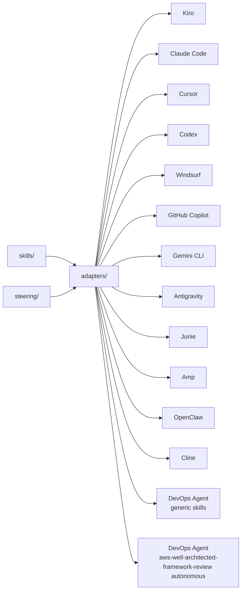

# 🏗️ Well-Architected Skills & Steering for AI Coding Agents

Reusable skills and steering that teach AI coding agents how to apply the [AWS Well-Architected Framework](https://docs.aws.amazon.com/wellarchitected/latest/framework/welcome.html). One set of playbooks, **15 supported tools**.

<div align="center">

**Kiro** · **Kiro CLI** · **Claude Code** · **Cursor** · **Codex** · **Windsurf** · **GitHub Copilot** · **Gemini CLI** · **Antigravity** · **Junie** · **Amp** · **OpenClaw** · **Cline** · **Cortex Code** · **AWS DevOps Agent**

</div>

> [!IMPORTANT]
> This sample is provided for educational and demonstrative purposes. It is not intended for production use without additional review and testing appropriate to your environment. Reference content is current as of the download date — keeping it up to date is the responsibility of the user.

> [!NOTE]
> **Deprecated.** AWS now ships an actively maintained equivalent — the
> `aws-well-architected-review` skill in
> [Agent Toolkit for AWS](https://github.com/aws/agent-toolkit-for-aws)
> ([product page](https://aws.amazon.com/products/developer-tools/agent-toolkit-for-aws/)).
> New feature/skill contributions to this repo are no longer accepted. This
> repository remains the portable contract, fixture, and regression source —
> see [SUCCESSOR_HANDOFF.md](SUCCESSOR_HANDOFF.md) and
> [issue #147](https://github.com/aws-samples/sample-well-architected-skills-and-steering/issues/147)
> for the full migration plan.

---

## 🎯 Why this exists

Developers don't stop to consult documentation — they ask their AI assistant. If the assistant doesn't know the Well-Architected Framework, the guidance never reaches the code.

This project embeds WA best practices **where development actually happens**: in the IDE, at the moment code is being written. Instead of treating architecture reviews as a separate gate, teams get continuous, contextual guidance that:

- ✅ Reduces rework by catching misalignments early
- ✅ Works across 15 AI coding tools with a single source of truth
- ✅ Needs no AWS credentials to install or use — the skills and reference data are files on disk (the optional eval harnesses in `evals/` are the exception; they call models and need credentials)
- ✅ Follows the open [Agent Skills specification](https://agentskills.io/)

---

## 📦 What's inside

```text
steering/                           Always-on context (Kiro)
  well-architected.md                 Pillars, design principles, review process
  aws-well-architected-framework-review.md                        Deep multi-step WA review (evidence-based, constrained)

skills/                             Step-by-step playbooks (tool-agnostic)
  aws-well-architected-framework-review/                          Full or pillar-scoped review (all 6 pillars + 27 lenses)
    references/manifest.md              Canonical catalog of all 307 BP IDs (loaded first)
    references/pillars/                 6 pillar-merged files (one per pillar; subagent references)
    references/lenses/                  Lens-specific references (27 lenses)
    references/pillar-playbooks/        Per-pillar deep-dive discovery procedures
  wa-builder/                         Learn WA + produce artifacts (diagrams, trees, roadmaps, ADRs)
  wa-guardrails/                      Preventive controls (Config rules, SCPs, CI checks)
  wafr-facilitator/                   Conversational WAFR facilitation with customers
  migration-readiness/                7 Rs assessment with migration plan

scripts/                            Maintenance tooling
  crawl-wa-framework.py               Crawl AWS docs to regenerate reference files

schemas/                            Structured output contracts
  aws-well-architected-framework-review-v1.schema.json            Versioned JSON Schema for aws-well-architected-framework-review.json
  README.md                           Contract, versioning policy, guarantees

tools/                              Standalone tooling (stdlib Python, no AWS)
  wa-ci/                              Gate a PR on the Well-Architected delta
    wa_ci.py                            Diff a review vs a baseline, classify, gate
    examples/                           Baseline + review + GitHub Actions workflow

adapters/                           Tool-specific configuration
  claude-code/                        CLAUDE.md + slash commands
  cursor/                             .cursor/rules/*.md
  codex/                              AGENTS.md
  windsurf/                           .windsurfrules
  github-copilot/                     .github/copilot-instructions.md
  cline/                              .clinerules
  gemini-cli/                         GEMINI.md
  antigravity/                        .agents/rules/*.md
  junie/                              .junie/guidelines + .junie/skills
  amp/                                .agents/skills/*.md
  openclaw/                           AGENTS.md + .agents/skills/*.md
  cortex-code/                        AGENTS.md + skills/*.md (Snowflake)
  devops-agent/                       Packaging for AWS DevOps Agent

powers/                             Kiro Powers
  aws-well-architected-framework-review/                          Full WA review with auto-activation and progressive references

evals/                              Automated evaluation runner (Bedrock)
  run.py                              CLI entry point
  grade.py                            LLM-as-judge grader
  report.py                           Scoring and terminal output
  config.yaml                         Bedrock region and model config
  benchmark.py                        Multi-model comparison runner
  benchmark_report.py                 Generate markdown tables from benchmark results
  benchmark_config.yaml               Models, prompt, and grading criteria
  pricing.local.yaml.example          Template for your own per-token rates (rates not tracked)
  pyproject.toml                      Dependencies (use uv sync)

plugin.json                         Agent Plugins 1.0.0 manifest (portable plugin package)
install.sh                          One-command setup (macOS/Linux)
install.ps1                         One-command setup (Windows PowerShell)
```

### Lens layouts and the pillar-lookup contract

The 27 lenses under `references/lenses/` ship in two layouts, mirroring how AWS
publishes each lens. Both are intentional and the crawler handles both:

- **Pillar-per-file** (10 lenses, e.g. `government/`, `migration/`) — one file
  per pillar, named for the pillar (`security.md`, `cost-optimization.md`).
- **Best-practice-per-file** (17 lenses, e.g. `iot/`, `telco/`) — one file per
  best practice, named for its BP ID (`IOTCOST01.md`, `TELCOOPS02.md`).

**Pillar-lookup contract:** a lens file's pillar is given by its `**Pillar**:`
header. Every pillar-organized lens file carries this field in both layouts, so
consumers walking the reference tree can read the pillar the same way regardless
of a lens's source shape. (Lenses that AWS does not organize by the 6 pillars —
e.g. `responsible-ai`, `devops-guidance` — omit the field.) Filenames remain a
secondary signal but are no longer required to derive the pillar.

---

## 🚀 Quick start

### One-liner (no clone needed)

#### Via [skills.sh](https://skills.sh)

```bash
npx skills add aws-samples/sample-well-architected-skills-and-steering
```

Auto-detects your AI agent and installs skills directly. Use `--list` to preview available skills, or `--skill <name>` to install a specific one:

```bash
# List available skills
npx skills add aws-samples/sample-well-architected-skills-and-steering --list

# Install a specific skill
npx skills add aws-samples/sample-well-architected-skills-and-steering --skill aws-well-architected-framework-review

# Install globally (user-level, applies to all projects)
npx skills add aws-samples/sample-well-architected-skills-and-steering -g
```

#### Via bootstrap script

**macOS / Linux:**

```bash
curl -sL https://raw.githubusercontent.com/aws-samples/sample-well-architected-skills-and-steering/main/bootstrap.sh | bash
```

**Windows (PowerShell):**

```powershell
& ([scriptblock]::Create((irm https://raw.githubusercontent.com/aws-samples/sample-well-architected-skills-and-steering/main/bootstrap.ps1)))
```

Auto-detects your AI tools (`.cursor/`, `.claude/`, `.kiro/`, `.junie/`, `.openclaw/`, etc.), installs for all of them, and cleans up.

To install for a specific tool instead:

```bash
# macOS / Linux
curl -sL .../bootstrap.sh | bash -s -- --tool kiro

# Windows (PowerShell)
& ([scriptblock]::Create((irm .../bootstrap.ps1))) -Tool kiro
```

#### Via Agent Plugins

This repo is a conformant [Agent Plugins 1.0.0](https://agent-plugins.org/) package: the root [`plugin.json`](plugin.json) manifest wraps the `skills/` core (each `skills/*/SKILL.md` already carries valid [Agent Skills](https://agentskills.io/) frontmatter) into a single portable plugin. Clients that ship a native Agent Plugins loader can install directly from the repository:

```bash
# Point your Agent Plugins-compatible client at the repository
https://github.com/aws-samples/sample-well-architected-skills-and-steering
```

This path is **additive** and does not replace the adapters or install scripts. The plugin is intentionally MCP-free (`mcp.json` is optional in the spec) because the skills read static pillar files rather than calling a server. Kiro-specific behavior (`powers/` and the Kiro agent config) is homed under the `extensions["dev.kiro"]` namespace, keeping the portable core clean. Tool-specific steering and rules translations (`.cursor/rules/`, `.windsurfrules`, `CLAUDE.md`, `.clinerules`, `GEMINI.md`, Copilot instructions) remain in `adapters/`, since they target formats outside the Agent Plugins ecosystem.

### Install script (from local clone)

**macOS / Linux:**

```bash
# Auto-detect tools in your project
./install.sh ~/my-project --tool auto

# Install for a specific tool
./install.sh ~/my-project --tool claude-code

# Install for multiple tools at once
./install.sh ~/my-project --tool kiro --tool claude-code --tool cursor

# Install for all supported tools
./install.sh ~/my-project --tool all

# Use symlinks for automatic updates
./install.sh ~/my-project --tool claude-code --symlink

# Install globally (applies to all projects)
./install.sh --global --tool claude-code
```

**Windows (PowerShell):**

```powershell
# Auto-detect tools in your project
.\install.ps1 -TargetDir C:\Projects\my-app -Tool auto

# Install for a specific tool
.\install.ps1 -TargetDir C:\Projects\my-app -Tool claude-code

# Install for multiple tools at once
.\install.ps1 -Tool kiro, claude-code, cursor

# Install for all supported tools
.\install.ps1 -Tool all -Force

# Install globally (applies to all projects)
.\install.ps1 -Global -Tool claude-code
```

> [!TIP]
> Use `--symlink` (bash) or `-Symlink` (PowerShell) to create symbolic links instead of copies. When this repo updates, your project gets the changes automatically without reinstalling. On Windows, symlinks require elevated permissions.

> [!NOTE]
> **Global installs** place files in your home directory (`~/CLAUDE.md`, `~/.kiro/`, `~/.cursor/`, etc.) and apply to all projects without their own config. Use project-level installation (the default) if you only want WA guidance for specific projects.
>
> **Existing files** — the installer prompts before overwriting. Use `--force` to skip confirmation.

---

### Manual installation

<details>
<summary><strong>🔹 Kiro</strong></summary>

macOS / Linux:

```bash
mkdir -p .kiro/steering .kiro/skills
cp path/to/this-repo/steering/well-architected.md .kiro/steering/
cp -r path/to/this-repo/skills/* .kiro/skills/
```

Windows (PowerShell):

```powershell
New-Item -ItemType Directory -Force -Path .kiro\steering, .kiro\skills
Copy-Item path\to\this-repo\steering\well-architected.md .kiro\steering\
Copy-Item -Recurse path\to\this-repo\skills\* .kiro\skills\
```

</details>

<details>
<summary><strong>🔹 Kiro Power (recommended for Kiro users)</strong></summary>

The Kiro Power bundles the aws-well-architected-framework-review skill + steering + all reference material into a single installable unit with keyword-based auto-activation.

**Install from local clone:**

```bash
git clone https://github.com/aws-samples/sample-well-architected-skills-and-steering.git
```

Then in Kiro: Powers panel → **Add Custom Power** → **Import power from a folder** → select `powers/aws-well-architected-framework-review/`

**What you get:**

- Auto-activates when you mention "well-architected", "architecture review", "security review", "reliability", etc.
- Loads only relevant steering based on your current task
- Parallel per-pillar reference loading (6 pillar files + 27 lens packs, one file per Task subagent) — managed automatically

> [!NOTE]
> Kiro's "Import from GitHub" expects `POWER.md` at the repository root. Since this repo contains multiple skills and adapters, the Power lives under `powers/aws-well-architected-framework-review/` and must be imported from a local folder. If you want GitHub-based import, you can fork just the `powers/aws-well-architected-framework-review/` directory into its own repo.

</details>

<details>
<summary><strong>🔹 Claude Code</strong></summary>

macOS / Linux:

```bash
cp path/to/this-repo/adapters/claude-code/CLAUDE.md ./CLAUDE.md
cp -r path/to/this-repo/adapters/claude-code/commands .claude/commands
```

Windows (PowerShell):

```powershell
Copy-Item path\to\this-repo\adapters\claude-code\CLAUDE.md .\CLAUDE.md
Copy-Item -Recurse path\to\this-repo\adapters\claude-code\commands .claude\commands
```

</details>

<details>
<summary><strong>🔹 Cursor</strong></summary>

macOS / Linux:

```bash
cp -r path/to/this-repo/adapters/cursor/rules .cursor/rules
```

Windows (PowerShell):

```powershell
Copy-Item -Recurse path\to\this-repo\adapters\cursor\rules .cursor\rules
```

</details>

<details>
<summary><strong>🔹 Codex (OpenAI)</strong></summary>

macOS / Linux:

```bash
cp path/to/this-repo/adapters/codex/AGENTS.md ./AGENTS.md
cp -r path/to/this-repo/skills ./skills
```

Windows (PowerShell):

```powershell
Copy-Item path\to\this-repo\adapters\codex\AGENTS.md .\AGENTS.md
Copy-Item -Recurse path\to\this-repo\skills .\skills
```

</details>

<details>
<summary><strong>🔹 Windsurf</strong></summary>

macOS / Linux:

```bash
cp path/to/this-repo/adapters/windsurf/.windsurfrules ./.windsurfrules
```

Windows (PowerShell):

```powershell
Copy-Item path\to\this-repo\adapters\windsurf\.windsurfrules .\.windsurfrules
```

</details>

<details>
<summary><strong>🔹 GitHub Copilot</strong></summary>

macOS / Linux:

```bash
mkdir -p .github
cp path/to/this-repo/adapters/github-copilot/.github/copilot-instructions.md .github/
```

Windows (PowerShell):

```powershell
New-Item -ItemType Directory -Force -Path .github
Copy-Item path\to\this-repo\adapters\github-copilot\.github\copilot-instructions.md .github\
```

</details>

<details>
<summary><strong>🔹 Gemini CLI</strong></summary>

macOS / Linux:

```bash
cp path/to/this-repo/adapters/gemini-cli/GEMINI.md ./GEMINI.md
cp -r path/to/this-repo/skills ./skills
```

Windows (PowerShell):

```powershell
Copy-Item path\to\this-repo\adapters\gemini-cli\GEMINI.md .\GEMINI.md
Copy-Item -Recurse path\to\this-repo\skills .\skills
```

</details>

<details>
<summary><strong>🔹 Antigravity</strong></summary>

macOS / Linux:

```bash
mkdir -p .agents/rules .agents/skills
cp -r path/to/this-repo/adapters/antigravity/rules/* .agents/rules/
for skill_dir in path/to/this-repo/skills/*/; do
  skill_name=$(basename "$skill_dir")
  mkdir -p ".agents/skills/$skill_name"
  cp "$skill_dir/SKILL.md" ".agents/skills/$skill_name/SKILL.md"
done
```

Windows (PowerShell):

```powershell
New-Item -ItemType Directory -Force -Path .agents\rules, .agents\skills
Copy-Item -Recurse path\to\this-repo\adapters\antigravity\rules\* .agents\rules\
Get-ChildItem path\to\this-repo\skills -Directory | ForEach-Object {
    New-Item -ItemType Directory -Force -Path ".agents\skills\$($_.Name)"
    Copy-Item "$($_.FullName)\SKILL.md" ".agents\skills\$($_.Name)\SKILL.md"
}
```

</details>

<details>
<summary><strong>🔹 Junie (JetBrains)</strong></summary>

macOS / Linux:

```bash
mkdir -p .junie/guidelines .junie/skills
cp path/to/this-repo/adapters/junie/guidelines.md .junie/guidelines/well-architected.md
cp -r path/to/this-repo/skills/* .junie/skills/
```

Windows (PowerShell):

```powershell
New-Item -ItemType Directory -Force -Path .junie\guidelines, .junie\skills
Copy-Item path\to\this-repo\adapters\junie\guidelines.md .junie\guidelines\well-architected.md
Copy-Item -Recurse path\to\this-repo\skills\* .junie\skills\
```

</details>

<details>
<summary><strong>🔹 Amp</strong></summary>

macOS / Linux:

```bash
cp path/to/this-repo/adapters/amp/AGENTS.md ./AGENTS.md
mkdir -p .agents/skills
cp -r path/to/this-repo/skills/* .agents/skills/
```

Windows (PowerShell):

```powershell
Copy-Item path\to\this-repo\adapters\amp\AGENTS.md .\AGENTS.md
New-Item -ItemType Directory -Force -Path .agents\skills
Copy-Item -Recurse path\to\this-repo\skills\* .agents\skills\
```

</details>

<details>
<summary><strong>🔹 OpenClaw</strong></summary>

macOS / Linux:

```bash
cp path/to/this-repo/adapters/openclaw/AGENTS.md ./AGENTS.md
mkdir -p .agents/skills
cp -r path/to/this-repo/skills/* .agents/skills/
```

Windows (PowerShell):

```powershell
Copy-Item path\to\this-repo\adapters\openclaw\AGENTS.md .\AGENTS.md
New-Item -ItemType Directory -Force -Path .agents\skills
Copy-Item -Recurse path\to\this-repo\skills\* .agents\skills\
```

</details>

<details>
<summary><strong>🔹 Cline</strong></summary>

macOS / Linux:

```bash
cp path/to/this-repo/adapters/cline/.clinerules ./.clinerules
```

Windows (PowerShell):

```powershell
Copy-Item path\to\this-repo\adapters\cline\.clinerules .\.clinerules
```

</details>

<details>
<summary><strong>🔹 AWS DevOps Agent</strong></summary>

macOS / Linux:

```bash
# Package all skills as zip files for upload to your Agent Space
./install.sh ~/output-dir --tool devops-agent
# Then upload each .zip from ~/output-dir/devops-agent-skills/ via the Operator Web App
```

Windows (PowerShell):

```powershell
# Package all skills as zip files for upload to your Agent Space
.\install.ps1 -TargetDir C:\output-dir -Tool devops-agent
# Then upload each .zip from C:\output-dir\devops-agent-skills\ via the Operator Web App
```

</details>

---

## ⚙️ How it works


```mermaid
graph LR
    S[skills/] --> A[adapters/]
    ST[steering/] --> A
    A --> K[Kiro]
    A --> CC[Claude Code]
    A --> CU[Cursor]
    A --> CO[Codex]
    A --> W[Windsurf]
    A --> GH[GitHub Copilot]
    A --> G[Gemini CLI]
    A --> AG[Antigravity]
    A --> J[Junie]
    A --> AM[Amp]
    A --> OC[OpenClaw]
    A --> CL[Cline]
    A --> DA[DevOps Agent<br/>generic skills]
    A --> DAR[DevOps Agent<br/>aws-well-architected-framework-review autonomous]
```

| Component | What it does |
| --------- | ------------ |
| **Skills** (`skills/*/SKILL.md`) | Self-contained, tool-agnostic playbooks. Any AI agent can follow them step-by-step. They don't depend on steering or on each other. |
| **Steering** (`steering/*.md`) | Always-on context loaded into every Kiro conversation. Other tools use equivalent mechanisms via adapters. |
| **Powers** (`powers/*/`) | Bundled, installable units for Kiro. Package steering + MCP tools + hooks into a single activatable power. |
| **Adapters** (`adapters/`) | Translate steering into each tool's native config format and wire up skills as commands or rules. |
| **Assets** (`assets/`) | Shared reference material (metrics, patterns, best practices) bundled with skills for tools that support it. |

### Tool compatibility matrix

| Tool | Steering mechanism | Skills mechanism |
| ---- | ------------------ | ---------------- |
| Kiro | `.kiro/steering/*.md` | `.kiro/skills/*/SKILL.md` |
| Kiro CLI | `.kiro/steering/*.md` | `.kiro/agents/well-architected.json` — run `kiro-cli chat --agent well-architected` |
| Claude Code | `CLAUDE.md` | `.claude/commands/*.md` (slash commands) |
| Cursor | `.cursor/rules/*.md` | Rules with conditional activation |
| Codex | `AGENTS.md` | References `skills/` directory |
| Windsurf | `.windsurfrules` | References `skills/` directory |
| GitHub Copilot | `.github/copilot-instructions.md` | Inline (no separate skill mechanism) |
| Cline | `.clinerules` | References `skills/` directory |
| Gemini CLI | `GEMINI.md` | References `skills/` directory |
| Antigravity | `.agents/rules/*.md` | `.agents/skills/*/SKILL.md` |
| Junie | `.junie/guidelines/*.md` | `.junie/skills/*/SKILL.md` |
| Amp | `AGENTS.md` | `.agents/skills/*/SKILL.md` |
| OpenClaw | `AGENTS.md` | `.agents/skills/*/SKILL.md` |
| Cortex Code | `AGENTS.md` | References `skills/` directory |
| AWS DevOps Agent | N/A (skills are self-contained) | `SKILL.md` zip upload to Agent Space — use `SKILL-devops-agent.md` for `aws-well-architected-framework-review` (see [AWS DevOps Agent](#aws-devops-agent)) |

---

## 🔁 Continuous Well-Architected (structured output + CI gate)

A review is a snapshot. To keep a workload aligned as it changes, `aws-well-architected-framework-review` also emits a
machine-readable `aws-well-architected-framework-review.json` alongside its markdown report (Step 6b), conforming to the
versioned contract in [`schemas/aws-well-architected-framework-review-v1.schema.json`](schemas/aws-well-architected-framework-review-v1.schema.json).
The markdown is for people; the JSON is for tools.

[`tools/wa-ci`](tools/wa-ci/) turns that artifact into a merge gate. Commit an accepted review as
`.well-architected/baseline.json`, then diff each PR's fresh review against it:

```bash
python3 tools/wa-ci/wa_ci.py \
  --baseline .well-architected/baseline.json \
  --current aws-well-architected-framework-review.json \
  --fail-on high
```

Each best practice is paired on its `bp_id` and classified as **Resolved**, **Still-open**,
**New**, or **Regressed**. Only New and Regressed gaps at or above `--fail-on` fail the build,
because those are what the change introduced; pre-existing gaps do not block an unrelated PR. The
gate never reads a missing finding as proof a control exists (coverage is high-recall, not
exhaustive), and it never mutates code. See [`tools/wa-ci/README.md`](tools/wa-ci/README.md) for
the classification rules and an example GitHub Actions workflow.

The same contract is the input a portfolio view would aggregate across many workloads.

---

## 🤖 Runtime capability matters

The skills work in every supported runtime, but one runtime capability changes how the full review behaves: **parallel subagent dispatch**. The full-review path dispatches one subagent per pillar, concurrently, and merges their findings into a single Full BP Ledger. A runtime that can't do that has to walk the pillars some other way.

**If your runtime has parallel `Task` dispatch** (Claude Code, Kiro), install `SKILL.md` and you get the pillar-per-subagent path by default.

**If it doesn't** (Codex, Cursor, GitHub Copilot, Gemini CLI, Amazon Q Developer), install [`SKILL-sequential.md`](skills/aws-well-architected-framework-review/SKILL-sequential.md) **instead of** `SKILL.md`. It walks the six pillars one at a time into the same Full BP Ledger — a deterministic path that needs no `Task` tool, in exchange for wall-clock. Installing the parallel `SKILL.md` on a runtime without `Task` is the failure mode worth avoiding: the review may stop after two or three pillars, and how far it gets varies run to run.

**Pillar-scoped mode is the pragmatic middle ground** on those runtimes. Scoping to one or two pillars keeps the work inside a single pass, so it behaves consistently even without subagent dispatch.

**Kiro tip:** in non-interactive mode (`--no-interactive`), add "do NOT offer follow-up actions" to your prompt. Without it, score mode offers the Full BP Ledger as a follow-up step instead of producing it inline, and you get a truncated report. This is a prompting detail of headless runs — interactive Kiro sessions don't have the issue.

**Don't take our word for any of this.** [`evals/cli_effectiveness/`](evals/cli_effectiveness/) is the harness we use to compare a runtime, a model tier, or a skill variant against a paired baseline. Point it at your runtime and read your own numbers — results are written to gitignored files and stay on your machine.

---

## 📋 Skills overview

| Skill | Pillar(s) | Use when you need to... |
| ----- | --------- | ----------------------- |
| `aws-well-architected-framework-review` | All 6 | Full or pillar-scoped WA assessment with BP-level citations |
| `wa-builder` | All 6 | Learn WA + produce artifacts (diagrams, decision trees, roadmaps, ADRs) |
| `wa-guardrails` | All 6 | Generate preventive controls (Config rules, SCPs, CI checks, alarms) |
| `wafr-facilitator` | All 6 | Prepare conversational WAFR facilitation with customers |
| `migration-readiness` | All 6 | Assess readiness to migrate a workload to AWS |

**Pillar aliases** (route to `aws-well-architected-framework-review` with pillar scope):

| Command | Scope |
|---------|-------|
| `security-assessment` | Security pillar deep-dive |
| `reliability-improvement-plan` | Reliability pillar deep-dive |
| `cost-optimization-review` | Cost Optimization pillar deep-dive |
| `performance-efficiency` | Performance Efficiency pillar deep-dive |
| `sustainability-optimization` | Sustainability pillar deep-dive |
| `operational-excellence` | Operational Excellence pillar deep-dive |
| `architecture-decision-record` | wa-builder ADR mode |

---

## 📊 Reference data and token consumption

The `aws-well-architected-framework-review` skill includes **307 best practices** across **57 framework questions** plus **27 lens extensions** — sourced directly from the [AWS Well-Architected public documentation](https://docs.aws.amazon.com/wellarchitected/latest/framework/welcome.html). This reference data lives in `skills/aws-well-architected-framework-review/references/` and is loaded one pillar file at a time (via parallel `Task` subagents in v4.2+), not all at once.

### Reference data summary

| Content | Files | Size | Loaded when |
|---------|-------|------|-------------|
| Framework pillars (merged) | 6 | 2.2 MB | Full review — one pillar file per parallel `Task` subagent (v4.2+) |
| Serverless Lens | 6 | 120 KB | Workload uses Lambda/API Gateway/Step Functions |
| Generative AI Lens | 29 | 368 KB | LLM, RAG, or fine-tuning workloads |
| Agentic AI Lens | 41 | 1.2 MB | AI agent workloads |
| Responsible AI Lens | 28 | 780 KB | AI governance and fairness requirements |
| Hybrid Networking Lens | 30 | 480 KB | Direct Connect, VPN, Transit Gateway |
| Migration Lens | 6 | 76 KB | Migration planning |
| DevOps Guidance Lens | 196 | 820 KB | CI/CD, automated governance, dev lifecycle, observability |
| Machine Learning Lens | 35 | 852 KB | ML lifecycle (MLOPS), training/deployment, data engineering, responsible ML |
| Data Analytics Lens | 6 | 180 KB | Data pipelines, governance, catalogs, lineage, analytics perf & cost |
| Games Industry Lens | 32 | 316 KB | Game backends, real-time multiplayer, player data, live ops |
| SaaS Lens | 6 | 112 KB | Multi-tenancy, tenant isolation, onboarding, metering, tiering |
| Financial Services Lens | 79 | 432 KB | FSI compliance, data residency, resilience, auditability |
| Life Sciences Lens | 56 | 468 KB | GxP, validated systems, clinical/research data, compliance |
| End User Computing Lens | 69 | 372 KB | Virtual desktops/apps, streaming, identity, endpoint delivery |
| Supply Chain Lens | 51 | 244 KB | Supply chain data, integration, traceability, resilience |
| Video Streaming & Advertising Lens | 43 | 296 KB | Video pipelines, streaming delivery, ad tech, monetization |
| Telco Lens | 34 | 272 KB | Telecom workloads, 5G/edge, OSS/BSS, carrier-grade reliability |
| SAP Lens | 6 | 380 KB | SAP on AWS, S/4HANA, HANA databases, SAP landscape resilience |
| Modern Industrial Data Technology Lens | 34 | 300 KB | Industrial data platforms, OT/IT convergence, manufacturing analytics |
| Microsoft Workloads Lens | 23 | 368 KB | Windows Server, SQL Server, Active Directory, .NET on AWS |
| Connected Mobility Lens | 6 | 284 KB | Connected vehicles, telematics, fleet data, automotive platforms |
| Healthcare Industry Lens | 6 | 92 KB | HIPAA, clinical data, interoperability, patient privacy |
| Container Build Lens | 6 | 76 KB | Container image builds, supply chain security, registries, CI/CD |
| High Performance Computing Lens | 23 | 104 KB | HPC clusters, parallel workloads, scheduling, low-latency networking |
| Streaming Media Lens | 6 | 96 KB | Media streaming, live/VOD delivery, encoding, content workflows |
| IoT Lens | 59 | 369 KB | IoT devices, telemetry, edge computing, fleet provisioning, OTA updates |
| Government Lens | 6 | 46 KB | Public sector, privacy-by-design, compliance, real-time security |

### Token strategies

A **full review** covers all 6 pillar files. Combined, that corpus is larger than most single-context windows can hold, which is why v4.2+ dispatches **one Task subagent per pillar** — each subagent loads only its own pillar file (~150–580 KB), so no single context has to hold the whole thing. Alternative modes for smaller footprints:

| Strategy | How | Best for |
|----------|-----|----------|
| **Quick review** | Ask for "quick review" — evaluates at question level using SKILL.md summaries only (no BP reference files loaded) | Fast feedback, budget-conscious |
| **Pillar-scoped** | Ask for specific pillars ("review security and reliability only") — loads only 2 pillar files | Targeted deep-dives |
| **Lens-only** | Ask for just a lens review ("evaluate against the serverless lens") — skips core pillars | Domain-specific checks |
| **Progressive** | Start quick, then drill into flagged pillars | Balanced depth vs cost |

> [!TIP]
> **Recommended workflow for cost-effective reviews:**
> 1. Start with a **quick review** to identify which pillars have gaps
> 2. Then do a **pillar-scoped full review** on only the weak areas
> 3. Apply a **lens** if the workload type warrants it
>
> This typically loads 1–2 pillar files (~100–300 KB) instead of all 6 (~2.2 MB) plus lenses.

> [!NOTE]
> **How the agent manages context:** In v4.2+, the skill dispatches **6 parallel `Task` subagents** (one per pillar) so each subagent's context holds only its own pillar file — the full 2.2 MB corpus is never in a single context. The manifest (~24 KB) is the only file the top-level agent loads upfront. See the `Coverage strategy` section in [aws-well-architected-framework-review/SKILL.md](skills/aws-well-architected-framework-review/SKILL.md) for full details.

### Estimating cost in your environment

What you pay is set by your provider's rates and by how much reference material the review loads. This repository publishes no cost figures — read your provider's current rates from their own pricing page ([Amazon Bedrock](https://aws.amazon.com/bedrock/pricing/), or your model vendor's) and multiply through the drivers below.

The drivers, heaviest first:

| Review type | Reference material loaded |
|-------------|---------------------------|
| **Quick review** | `SKILL.md` summaries only — no BP reference files |
| **Pillar-scoped** | 1–2 pillar files |
| **Full review, subagent-mode** | all 6 pillar files, one per parallel subagent |
| **+ a lens** | that lens's files on top of the above — see the sizes in the table above (they range from tens of KB to over a MB) |

Output tokens add to that: the report itself is the output, so a review that finds more gaps costs more to write than one that finds few.

**Cost-saving tips:**
- Use the two-pass approach (default) — only loads files for questions with gaps
- Scope to specific pillars — e.g., "review security only" loads one pillar file instead of six
- Use a smaller model for Pass 1 (quick scan) and a stronger model for Pass 2 (deep dive)
- Enable prompt caching if your provider supports it — the reference files are static and cache well

### Regenerating reference data

The reference files are committed to this repo as a snapshot of the AWS Well-Architected public docs at the time of the last crawl. **You are responsible for checking whether the data needs updating before use** — AWS updates the framework and lens pages over time, and stale references can produce outdated guidance. If in doubt, compare a few BP pages against the [live AWS docs](https://docs.aws.amazon.com/wellarchitected/latest/framework/welcome.html) or re-run the crawler. To refresh:

```bash
# Regenerate all 6 pillar-merged framework files
uv run scripts/crawl-wa-framework.py

# Regenerate a single pillar
uv run scripts/crawl-wa-framework.py --pillar security

# Add or refresh a lens
uv run scripts/crawl-wa-framework.py --lens https://docs.aws.amazon.com/wellarchitected/latest/serverless-applications-lens/welcome.html

# Lenses that use the dotted best-practice ID format (e.g. DevOps Guidance)
uv run scripts/crawl-wa-framework.py --lens https://docs.aws.amazon.com/wellarchitected/latest/devops-guidance/devops-guidance.html --lens-name devops-guidance
```

### Data strategy — why static pillar files, not MCP

The reference corpus lives in `skills/aws-well-architected-framework-review/references/pillars/*.md` as **6 pre-crawled markdown files**, not as an MCP retrieval server. This is a deliberate design choice, not convention. The trade-offs:

**Static pillar files (what this repo ships):**

- **One file load per subagent.** aws-well-architected-framework-review's full-review dispatches 6 parallel Task subagents; each subagent loads exactly one pillar file and holds the entire pillar (30–55 BPs) in a single context window. Zero back-and-forth.
- **Snapshot in time.** The files are a snapshot of the AWS Well-Architected docs at the last crawl. Users must check freshness before use (see the regeneration section above). This is honest — we can't lie about live data if we hold static data.
- **Predictable token cost.** Loading a pillar file is a one-shot input-token charge, and it caches well because the corpus is static. The same review loads the same material every time, so cost doesn't wander between runs.
- **No infrastructure to run.** No MCP server, no auth, no availability concerns. The skill works offline once installed.

**Why not MCP retrieval per BP?**

MCP servers do incremental retrieval — the agent asks "give me guidance for SEC03-BP02," gets a chunk, decides what to look up next, and iterates. That model has real drawbacks for this workload:

- **Turn explosion.** Full-review coverage needs 307 BPs evaluated. If retrieval is one BP per call, the agent spends 300+ tool-use turns on retrieval alone — before it's written a single finding.
- **Coverage stops early.** Models that have to fetch citations one at a time stop well short of full coverage, and it isn't a prompt problem — no amount of "evaluate all 307" pressure changes it. Once the agent has enough material to write *some* findings, it converges on writing them instead of continuing to retrieve.
- **Token overhead.** Each MCP call carries protocol overhead, tool-use framing, and the accumulated agent context. Pre-loading one pillar file per subagent pays the framing cost once instead of paying it per call.
- **Cache-unfriendly.** MCP responses vary by query; static pillar files are byte-identical across runs and cache perfectly.

**The pillar-merged shape specifically** (not 57 per-question files): per-question files force the agent to navigate 57 file names to guess what to read, and every guess is a chance to read the wrong thing. Pillar-merged files map 1:1 onto the subagent dispatch pattern, so each subagent gets exactly one file and sees its pillar as a coherent whole. If you want to compare the two layouts on your own models, [`evals/cli_effectiveness/`](evals/cli_effectiveness/) is the harness for it.

### When to use each review mode (CI/CD guidance)

Full review is the heaviest mode — it loads all six pillar files and writes a full BP ledger. It's built for **one-shot architecture assessments**, the kind of review a human would set aside a large block of time for. It is not built for per-commit CI checks.

For CI/CD workflows, reach for lighter modes:

| Mode | Trigger phrase | Reference material loaded | Use when |
| ---- | -------------- | ------------------------- | -------- |
| **Score** | "score this architecture", "grade this" | none — scorecard only | Fast pass/fail signal, pillar scorecard only |
| **Quick review** | "quick review", "high-level" | none — `SKILL.md` summaries | Question-level assessment, no BP files loaded |
| **Pillar-scoped** | "review only security and reliability" | 1–2 pillar files | Deep-dive on 1–2 pillars |
| **Full review** | "WA review", "comprehensive review" | all 6 pillar files | One-time architecture assessment |

Practical guidance:

- **PR gates**: Score or pillar-scoped for the pillar most affected by the change (e.g. IaC change → REL + SEC scope, not full review). These are the light paths; time them on your own workload before wiring one into a blocking gate.
- **Weekly / monthly audits**: Full review is appropriate — the cost lands once per audit cycle rather than once per commit.
- **Deployment gates**: Score mode filtered to Critical/High severity — fast, actionable, doesn't block on Medium/Low findings.
- **Human review supplement**: Full review before a human WA session; the ledger becomes the reviewer's checklist. Coverage is high-recall but not exhaustive, so the reviewer's judgement is still the authority — an absent finding is not proof a control exists.

---

## ✅ Verifying it works

Ask your AI coding agent:

```text
What Well-Architected pillars should I consider for this architecture?
```

If configured correctly, it will reference all six pillars with specific guidance rather than giving a generic answer.

> [!TIP]
> **Claude Code users**: try `/aws-well-architected-framework-review` to invoke the full review skill as a slash command.
>
> **Kiro users**: the steering loads automatically — just start discussing architecture and the agent applies WA principles.

---

## 🧪 Evaluating skills

Each skill includes structured evaluations in `skills/*/evals/evals.json` following the [Agent Skills eval spec](https://agentskills.io/skill-creation/evaluating-skills). Evals let you measure whether the skills produce better outputs than a bare agent.

> [!IMPORTANT]
> **Two frameworks — pick the right one for your skill.** This repo ships two eval harnesses because a single one can't fairly measure both kinds of skills:
>
> - **[`evals/run.py`](./evals) (raw Bedrock Converse + LLM-as-judge)** — cheap, fast, fair for skills whose value lives entirely in the `SKILL.md` prose (`wa-builder`, `wa-guardrails`, `wafr-facilitator`, `migration-readiness`). Cannot execute `Task` subagents or MCP tools.
> - **[`evals/cli_effectiveness/`](./evals/cli_effectiveness) (real `claude -p` CLI + paired baseline + F1 vs ground truth)** — the honest framework for skills that depend on runtime tools. **Use this for `aws-well-architected-framework-review`.** It executes real agent runs end to end, so it is materially more expensive than the Converse runner — check your provider's rates before launching a full sweep, and smoke-test with `--cases 1 --runs 1`.
>
> Running `evals/run.py --skill aws-well-architected-framework-review` produces misleading numbers because Converse can't dispatch the pillar subagents aws-well-architected-framework-review relies on. The runner prints a banner warning about this — but the honest measure is under `cli_effectiveness/`.

Each test case includes:

- A realistic user prompt
- Expected output description
- 5-7 concrete assertions (gradable as PASS/FAIL)

### Automated eval runner

The `evals/` directory contains an automated evaluation runner powered by **Amazon Bedrock**.

**Prerequisites:**

- Python 3.13+ and [uv](https://docs.astral.sh/uv/)
- AWS credentials configured with Bedrock access (`aws configure` or SSO)
- Bedrock model access enabled for the models in `evals/config.yaml` (Claude Opus 4.8 by default) in your region

**Setup:**

```bash
cd evals
uv sync
```

**Run evaluations:**

macOS / Linux / Windows (PowerShell):

```bash
# List available skills
uv run python run.py --list

# Evaluate a single skill
uv run python run.py --skill aws-well-architected-framework-review --verbose

# Evaluate all skills with parallel case execution
uv run python run.py --parallel --verbose

# Save results for historical tracking
uv run python run.py --parallel --save
```

> [!NOTE]
> On Windows, ensure your AWS credentials are configured via `aws configure` or environment variables (`AWS_ACCESS_KEY_ID`, `AWS_SECRET_ACCESS_KEY`, `AWS_SESSION_TOKEN`). If using AWS IAM Identity Center (SSO), run `aws sso login --profile your-profile` first.

**How it works:**

1. For each test case, generates two responses via Bedrock Converse API:
   - **Baseline** — prompt only, no skill context
   - **With skill** — prompt + SKILL.md injected as system context
2. An LLM-as-judge grades each assertion as PASS/FAIL against both outputs
3. Reports a score comparison showing the skill's impact

**Configuration** (`evals/config.yaml`):

```yaml
provider: bedrock
region: us-east-1
generation_model: us.anthropic.claude-opus-4-8
grading_model: us.anthropic.claude-opus-4-8
max_tokens: 16384
```

**How cost scales:**

Each eval case costs two model calls per arm — one generation, one grading — so a run's cost is linear in the number of cases:

| Scope | Generation calls | Grading calls |
| ----- | ---------------- | ------------- |
| Single skill (3 cases) | 6 | 6 |
| All skills | 2 × total cases | 2 × total cases |

Multiply that by the current [Amazon Bedrock pricing](https://aws.amazon.com/bedrock/pricing/) for your region and the models in `config.yaml` to get your own estimate. Generation calls dominate — they produce the long output; grading calls are short. Two levers: `--parallel` runs cases concurrently, which cuts wall-clock but not cost, and switching `config.yaml` to a cheaper model (Sonnet, Haiku) cuts cost directly.

> [!TIP]
> **Experiment with other models!** The eval runner works with any model available in Bedrock — try Amazon Nova, Meta Llama, Mistral, or others to see how different foundation models respond to skill guidance. Use the discovery utility to see what's available in your region:
>
> `uv run python list_models.py`
>
> Then update `generation_model` in `config.yaml` to try a different model. The grading model should remain a strong model (Claude Opus/Sonnet) for reliable assertion grading. Note: Opus 4.8 does not support the `temperature` parameter — the runner handles this automatically.

> [!TIP]
> Start by running a single skill eval (`--skill aws-well-architected-framework-review --verbose`) to see detailed per-assertion grading. The delta between baseline and with-skill scores quantifies the value each skill adds.

**Using this framework for your own skills**

The `evals/` runner is skill-agnostic — it reads `skills/{name}/SKILL.md` and `skills/{name}/evals/evals.json` from wherever you point it. To evaluate a skill you're developing:

1. Drop your skill directory under `skills/` (or fork this repo and add it there).
2. Author an `evals.json` with 3–7 realistic prompts and PASS/FAIL assertions per case ([spec](https://agentskills.io/skill-creation/evaluating-skills)).
3. Run `uv run python run.py --skill your-skill --verbose`.
4. Iterate on `SKILL.md` until the with-skill score meaningfully beats baseline.

The paired-comparison approach (with skill vs bare model, same prompts) is the fair way to measure whether SKILL.md content is actually earning the tokens it costs. If the two arms score about the same, the guidance is probably too generic to move the model — worth revisiting.

> [!NOTE]
> **Limitation to be aware of.** The `evals/` runner uses raw Bedrock Converse API, which has no `Task` tool. Skills whose value depends on subagent dispatch (like aws-well-architected-framework-review's full-review mode) will look weaker here than they actually are in Claude Code / Kiro. See the [Real Agent evaluation](#real-agent-evaluation) section for how aws-well-architected-framework-review is measured in a Task-capable runtime.

---

## 📈 Effectiveness

**This repository publishes the harnesses, not our numbers.** Every skill ships eval cases, and both runners print a baseline-vs-skill comparison you produce yourself — on your models, in your region, against your workloads. A figure measured on our prompts at some past moment wouldn't tell you what the skill does for you, so you won't find one here.

Two frameworks, because a single one can't fairly measure both kinds of skills. Both compare with-skill against a matched baseline; the metric differs:

| Skill | Framework | Metric you get |
| ----- | --------- | -------------- |
| `aws-well-architected-framework-review` † | [`evals/cli_effectiveness/`](./evals/cli_effectiveness) — real `claude -p` runtime, paired `--safe-mode` baseline | Citation F1, recall, and precision against a consensus ground truth |
| `wa-builder` | [`evals/run.py`](./evals) — raw Bedrock Converse | Share of PASS assertions, LLM-as-judge |
| `wa-guardrails` | [`evals/run.py`](./evals) — raw Bedrock Converse | Share of PASS assertions, LLM-as-judge |
| `wafr-facilitator` | [`evals/run.py`](./evals) — raw Bedrock Converse | Share of PASS assertions, LLM-as-judge |
| `migration-readiness` | [`evals/run.py`](./evals) — raw Bedrock Converse | Share of PASS assertions, LLM-as-judge |

† `aws-well-architected-framework-review` needs the CLI harness because its full-review path depends on the `Task` tool (one pillar subagent per pillar, v4.2+). Raw Bedrock Converse has no Task tool, so it can't execute the skill's dispatch pattern at all; scoring the skill there measures a crippled version of it. See [Real agent evaluation](#real-agent-evaluation) below for the measurement design, and [`evals/cli_effectiveness/`](./evals/cli_effectiveness) for the harness code and ground truth.

> [!IMPORTANT]
> **Don't run `evals/run.py --skill aws-well-architected-framework-review` and trust the number.** The raw Converse framework can't execute Task subagents, and aws-well-architected-framework-review's value is largely in that dispatch pattern. Use [`evals/cli_effectiveness/`](./evals/cli_effectiveness) instead — it measures the skill in a real `claude -p` runtime with a paired `--safe-mode` baseline. If you're evaluating a skill you're developing that ALSO depends on runtime tools (Task, MCP, etc.), use the CC CLI harness as a template rather than the Converse runner.

### Real agent evaluation

The design of the measurement, which is the part worth publishing:

- **Real runtime.** The skill runs inside an actual agent CLI, not a bare model API, so the pillar-subagent dispatch actually executes.
- **Paired arms.** Every case runs twice: once with the skill installed, once against a `--safe-mode` baseline from an empty scratch workdir. Same prompts, same model, same scoring. The only variable removed is the skill.
- **Repeated runs per case**, so run-to-run variance is visible instead of averaged into a single lucky number.
- **Six workload cases** spanning serverless, a financial multi-account estate, SaaS multi-tenancy, ML/GenAI, a pillar-scoped request, and score mode.
- **Consensus ground truth**, not a hand-written answer key: two models from different provider families, several independent runs each, and a BP counts as applicable only when both models cite it in a majority of their runs.
- **Pillar-scoped cases are scored against only their own pillars' subset** of the ground truth — the skill correctly reviews two pillars when asked for two, and shouldn't be penalized for the four it was told to skip.

Run it: [`evals/cli_effectiveness/README.md`](evals/cli_effectiveness/README.md) has the commands. Results land in gitignored files on your machine.

<details>
<summary><b>How to read the numbers the harness gives you</b></summary>

**The metrics**

- **Recall** — "of every BP that applies to this workload, how many did the review cite?" Range 0–1. Higher means fewer applicable BPs went unmentioned.
- **Precision** — "of the BPs the review cited, how many were actually applicable?" Range 0–1. Higher means less noise.
- **F1** — the harmonic mean of recall and precision. One number that only stays high when *both* are high. Citing all 307 BPs would tank precision; citing five obvious ones would tank recall. Neither shortcut scores well.

**The two layers**

- **Subagent analysis** — the raw output of the pillar subagents, combined. This is the *underlying analysis* the skill produces.
- **Assembled report** — what the top-level agent synthesizes into the final user-facing report after the subagents return. This is *what the user actually sees*.

Score both. The gap between them is compression: findings the subagents produced and the assembler dropped. The mandatory Full BP Ledger section (see [SKILL.md Step 4c](skills/aws-well-architected-framework-review/SKILL.md)) exists to close that gap by requiring the assembler to carry every citation forward, and comparing the two layers is how you check that it did.

**How "applicable" is decided (ground truth)**

For each workload, a separate consensus panel: two models from different provider families (Claude Sonnet 5 and GPT OSS 120B, in the shipped ground truth), five independent runs each. A BP counts as applicable only if **both** models cited it in **≥3 of their 5 runs** — a set neither model alone could have hallucinated into existence. See [`evals/cli_effectiveness/README.md`](evals/cli_effectiveness/README.md) for how to re-derive it with your own panel.

**Baseline definition**

The "without skill" arm is `claude -p --safe-mode --disable-slash-commands` invoked from an empty scratch workdir. `--safe-mode` disables all skills, CLAUDE.md discovery, plugins, hooks, and MCP servers. `--disable-slash-commands` blocks explicit skill invocation. Same case prompts, same model, same ground truth scoring — the only variable removed is the skill.

**Scope**

Whatever you measure is scoped to what you ran: your runtime, your model tier, your skill version, your number of runs, your cases. It is not a universal claim about all models or runtimes — results vary with the underlying model's capability and the runtime's tool support. Ours were no different, which is why they aren't published here.
</details>

**Other modes** (score / quick / pillar-scoped) don't depend on subagent dispatch, so they work in raw Converse too and `evals/run.py` measures them fairly.

Both harnesses live in [`evals/`](./evals) so you can measure on your own models and prompts. `--parallel` runs cases concurrently to cut wall-clock.

---

## 🏎️ Model Benchmark

`evals/benchmark.py` compares foundation models on a Well-Architected review task — **quality**, **latency**, **throughput**, and **token usage**, side by side. Models are consumed through **Amazon Bedrock**; no direct provider APIs.

It benchmarks the **subagent-mode full review** — the shipped skill's default path, which dispatches one Converse call per pillar with pre-loaded pillar references — so what it measures is what your users would actually experience. Token accounting covers every subagent call in the review, not just one.

> [!IMPORTANT]
> **No benchmark results are published here, by design.** Model quality, pricing, latency, and availability differ by workload, region, and Bedrock tier, and they change over time — a table we measured on one prompt at one moment is not a basis for your model-selection or cost decision. **Run the benchmark on your own prompts and requirements.** The harness is below; results are written to `evals/results/`, which is gitignored and stays on your machine.

**Run it:**

```bash
cd evals
uv sync

# Quick run (no grading) — just latency and token counts
uv run python benchmark.py

# Full run with quality grading
uv run python benchmark.py --grade

# Test specific models
uv run python benchmark.py --models us.anthropic.claude-sonnet-5 us.amazon.nova-pro-v1:0

# Render a results file as a comparison table
uv run python benchmark_report.py results/benchmark-YYYYMMDD-HHMMSS.json
```

What you get: one row per model with input and output tokens, wall-clock latency, throughput, and — with `--grade` — a quality score from a grading model, judged on pillar coverage, identification of key risks, and actionability. Configure models, prompts, and grading in [`evals/benchmark_config.yaml`](evals/benchmark_config.yaml). Add models as they become available in Bedrock and re-run to keep your own comparison current.

**To get a cost column too,** copy [`evals/pricing.local.yaml.example`](evals/pricing.local.yaml.example) to `evals/pricing.local.yaml` and fill in the current per-token rates for the models you run. The example ships every rate as `null` and links the pricing pages to look them up on: this repository does not restate AWS's or any other provider's published prices, and your file is gitignored. Without it, the cost column is omitted.

---

## AWS DevOps Agent

The AWS DevOps Agent operates differently from coding agents — it runs **autonomously** in response to incidents and operational events, not developer prompts. `aws-well-architected-framework-review` ships a dedicated variant that fits this model.

| File | Use when |
| ---- | -------- |
| `SKILL.md` | Claude Code, Kiro, and all interactive coding agents |
| `SKILL-devops-agent.md` | AWS DevOps Agent — autonomous, post-incident, no checkpoints |

**Key differences in `SKILL-devops-agent.md`:**

- **Triggers** on post-incident root cause analysis and explicit on-demand requests — not on generic "WA review" phrases
- **Workload discovery** derives context from the incident ticket, investigation findings, metrics, logs, and source code already accessed — never asks the user
- **No interactive checkpoints** — the `---STOP---` confirmation blocks are replaced with non-blocking progress notes
- **Post-incident framing** — connects WA findings to the incident timeline, elevates severity for proven failure modes, leads the Executive Summary with the incident trigger
- **On-premises support** — when no IaC exists, uses metrics, logs, and source code as evidence
- **Agent type targeting** — `INCIDENT_RCA` + `ON_DEMAND` instead of `GENERIC`

**To upload to your Agent Space:**

```bash
# Generate a DevOps Agent-compatible zip for aws-well-architected-framework-review (16 files, <1 MB)
./install.sh --devops-agent --skill aws-well-architected-framework-review
# -> aws-well-architected-framework-review-devops-agent.zip in the current directory

# Windows (PowerShell):
#   .\install.ps1 -DevOpsAgent -Skill aws-well-architected-framework-review

# Then upload aws-well-architected-framework-review-devops-agent.zip via the Operator Web App.
```

The `--devops-agent` flag packages `SKILL.md`, `metadata.json`, and everything
under `references/` **except** the lens corpus. When a skill ships DevOps Agent
variants (`SKILL-devops-agent.md` / `metadata-devops-agent.json`), those are
packaged under the standard `SKILL.md` / `metadata.json` names. Omit `--skill`
to package every skill. Run without arguments to package all skills.

> [!NOTE]
> The zip excludes lens files — the full skill directory (970+ files) exceeds the DevOps Agent documented per-zip file limit. Full-review subagent dispatch uses only the 6 pillar files; lenses can be added per-deployment if needed.

---

## 🤝 Contributing

We welcome contributions from the community! See [CONTRIBUTING.md](CONTRIBUTING.md) for guidelines on adding skills, modifying steering files, or adding new tool adapters.

> [!NOTE]
> This is a community-driven project. Anyone can collaborate and improve the skills and steering docs through Pull Requests. Adapt them to your domain, add new patterns, and share back.

---

## 🔒 Security

See [CONTRIBUTING](CONTRIBUTING.md#security-issue-notifications) for more information.

---

## 📄 License

This project is licensed under the [MIT-0 License](LICENSE).

---

## 📚 Related Resources

- [AWS Well-Architected Framework](https://docs.aws.amazon.com/wellarchitected/latest/framework/welcome.html)
- [Kiro — AI-powered IDE](https://kiro.dev)
- [AWS DevOps Agent](https://docs.aws.amazon.com/devopsagent/latest/userguide/)
- [Agent Skills Specification](https://agentskills.io/)
- [skills.sh — Skills directory for AI agents](https://skills.sh)

<!--
Copyright Amazon.com, Inc. or its affiliates. All Rights Reserved.
SPDX-License-Identifier: MIT-0
-->
